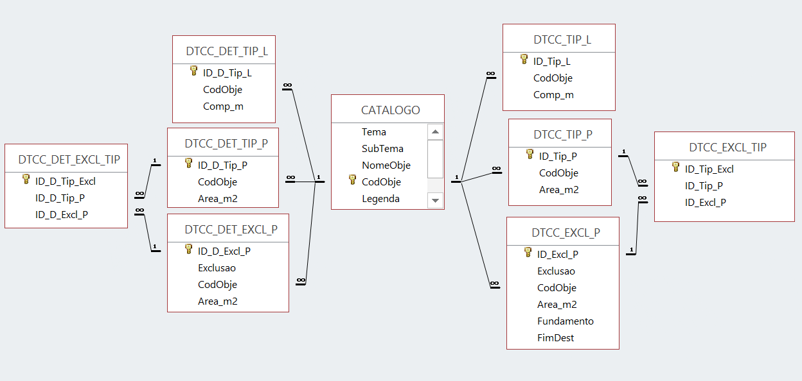
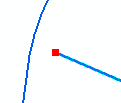
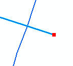

# Reserva Ecológica Nacional

## Norma Técnica para a Produção e Reprodução das Cartas de Delimitação da REN

### Versão 31-12-2021

# Índice
[Índice](#índice)

[Introdução](#introdução)

I [Objeto](#i-objeto)

II [Estruturação da Informação Geográfica](#ii-estruturação-da-informação-geográfica)

1. [Catálogo de Objetos da Carta de Delimitação da REN](#catálogo-de-objetos-da-carta-de-delimitação-da-ren)
2. [Estrutura da Base de Dados Geográfica](#estrutura-da-base-de-dados-geográfica)
3. [Boas Práticas na Digitalização e Classificação dos Objetos](#boas-práticas-na-digitalização-e-classificação-dos-objetos)

III [Composição Gráfica](#iii.-composição-gráfica)
 1. [Regras Gerais para a Reprodução em Formato Imagem](#regras-gerais-para-a-reprodução-em-formato-imagem)
 2. [Legendas](#legendas)
 3. [Catálogo de Simbologia](#catálogo-de-simbologia)

Anexo I [Catálogo de objetos da carta de delimitação da REN](#anexo-i-catálogo-de-objetos-da-carta-de-delimitação-da-ren)

Anexo II A [Tabelas que integram a base de dados](#anexo-ii-a---tabelas-que-integram-a-base-de-dados)

Anexo II B [Base de dados relacional](#anexo-ii-b---base-de-dados-relacional)

Anexo III [Boas práticas na digitalização e classificação dos objetos](#anexo-iii-boas-práticas-na-digitalização-e-classificação-dos-objetos)

Anexo IV [Catálogo de simbologia](#anexo-iv---catálogo-de-simbologia)

Anexo V [Códigos da divisão administrativa do Instituto Nacional de Estatística](#anexo-v---códigos-da-divisão-administrativa-do-instituto-nacional-de-estatística)

# Introdução

O Regime Jurídico da Reserva Ecológica Nacional (RJREN) estabelecido no D.L. n.º 166/2008, de 22 de agosto, republicado pelo Decreto-Lei n.º 124/2019, de 28 de agosto, prevê dois níveis na delimitação da REN: um nível estratégico concretizado através orientações estratégicas nacionais e regionais e um nível operativo concretizado através da elaboração de cartas de delimitação da REN de âmbito municipal.

As Orientações Estratégicas Nacionais e Regionais (OENR), revistas pela Portaria n.º 336/2019, de 26 de setembro, especificam as diretrizes e os critérios para a delimitação das áreas integradas na REN que são apresentados no Anexo I do RJREN.

Entre as diretrizes estabelecidas nas OENR, destaca-se a que determina a disponibilização no sítio da Internet da Comissão Nacional do Território (CNT), de normas e especificações técnicas para a produção e reprodução das cartas de delimitação da REN (diretriz 17).

As normas e especificações técnicas que a seguir se apresentam têm como objetivo harmonizar e estruturar a informação vetorial das cartas de delimitação da REN muncipal. Visam, ainda, estabelecer regras para a reprodução da carta em formato matricial que deve ser submetida na plataforma do Sistema de Submissão Automática dos Instrumentos de Gestão Territorial para efeitos de publicação no Diário da República e depósito na DGT. São compostas por 3 partes:

1.  Tendo como base de partida o conteúdo da carta da REN e as diretrizes para a sua delimitação previstos no RJREN e nas OENR, os princípios e normas para a produção cartográfica no território nacional previstos no Decreto-Lei n.º 193/95, de 28 de julho, na redação do Decreto-Lei n.º 130/2019, de 30 de agosto, bem como os conceitos técnicos atualizados nos domínios do ordenamento do território e do urbanismo fixados pelo Decreto Regulamentar n.º 5/2019, de 27 de setembro, foram estabelecidos, para efeitos da aplicação destas normas e especificações técnicas, os conceitos de "carta base" e de "carta de delimitação da REN", bem como os requisitos aplicados a cada uma.

2. Devendo a informação da REN ser fornecida em suporte digital e formato vetorial tendo em vista a sua integração em sistemas de informação geográfica nacionais e regionais (diretriz 13 das OENR), foi desenvolvido um modelo de estruturação da informação gráfica e alfanumérica que integra o catálogo de objetos da carta de delimitação da REN, a estrutura da base de dados geográfica e um conjunto de boas práticas a utilizar na representação dos objetos.
 
3. Para a reprodução da carta de delimitação da REN em formato imagem, foram definidas as regras gerais a observar na preparação de composições gráficas e na elaboração de legendas e foi desenvolvida, a título de orientação, um catálogo com a simbologia e convenções gráficas a utilizar.

O trabalho de produção destas normas e especificações técnicas foi desenvolvido na Direção-Geral do Território, concretamente na Direção de Serviços do Ordenamento do Território e teve a colaboração dos membros do Grupo de Trabalho da REN.

# I Objeto

1.  A **carta de delimitação da REN** é a cartografia temática que representa as áreas incluídas na REN, apresentada por tipologia, e as áreas excluídas da REN, apresentadas por tipo de exclusão, numeradas e com indicação da(s) tipologia(s) abrangida(s), representadas sobre uma carta base.

2.  A **carta base da REN** é a carta obtida a partir da cartografia de base, oficial ou homologada, por seleção da informação relevante para a elaboração da carta de delimitação da REN.

3.  São **requisitos da carta base** as seguintes:

    1.  A carta base é obtida a partir de cartografia topográfica vetorial (que deve ter como conteúdo mínimo informação oro-hidrográfica tridimensional, redes rodoviária e ferroviária, construções e informação toponímica), sem prejuízo de poder ser utilizada cartografia topográfica de imagem (ou ortofotocartografia) desde que a mesma seja completada por informação vetorial oro-hidrográfica tridimensional, redes rodoviária e ferroviária e informação toponímica, consistente com a imagem do ponto de vista espacial e temporal.
    2.  A exatidão posicional planimétrica da cartografia de base deve ser melhor ou igual que 5 metros e a exatidão temática deve ser melhor ou igual que 95%.
    3.  A exatidão posicional e temática da carta base é igual à exatidão posicional e temática da cartografia de base da qual foi derivada.
    4.  A carta base é elaborada no sistema de georreferência PT-TM06/ETRS89.

4.  Os **requisitos da carta de delimitação da REN** municipal são as seguintes:

    1.  A carta de delimitação da REN é elaborada em suporte digital e formato vetorial.

    2.  A carta de delimitação da REN abrange integralmente o território municipal definido pela Carta Administrativa Oficial de Portugal (CAOP) publicada pela DGT e disponível no respetivo sítio da Internet, devendo ser utilizada:

        1. a edição da CAOP disponível à data que determina a elaboração, revisão ou alteração de planos territoriais, quando a REN é delimitada no âmbito destes planos (Artigo 15º do RJREN).
        2. a edição da CAOP disponível à data em que a câmara municipal apresenta a proposta de delimitação da REN à CCDR (artigo 11º do RJREN), quando a REN não é delimitada no âmbito de planos territoriais.

    3.  Para além da delimitação municipal da REN e sempre que se justifique, podem ser efetuadas delimitações de pormenor (por exemplo área abrangida por um plano de urbanização ou pormenor, por um projeto ou por uma ou mais exclusões da REN).

    4.  A exatidão posicional e temática da carta de delimitação da REN municipal é igual à utilizada na carta base, sendo que uma delimitação de pormenor recorre a cartografia de base de maior detalhe (maior detalhe significa ter mais informação) e de maior exatidão posicional e temática.

    5.  A carta de delimitação da REN utiliza o sistema de georreferência PT-TM06/ETRS89.

    6.  A informação gráfica e alfanumérica da carta de delimitação da REN é estruturada de acordo com um modelo composto pelo catálogo de objetos e a base de dados geográfica.

# II Estruturação da Informação Geográfica

## 1. Catálogo de Objetos da Carta de Delimitação da REN

5.  As áreas a incluir na REN e as áreas a excluir da REN constituem as entidades a representar em cada carta de delimitação de REN municipal.

6.  A integração de áreas na REN deve ser feita de acordo com 19 tipologias, agregadas em 3 categorias, conforme se tratem de Áreas de proteção do litoral, Áreas relevantes para a sustentabilidade do ciclo hidrológico terrestre ou Áreas de prevenção de riscos naturais. A desagregação de cada uma das 19 tipologias nos seus elementos constituintes resultou na identificação de 36 entidades passíveis de representação.

7.  A necessidade de serem excluídas áreas da REN deve ser ponderada conforme se tratem de áreas com edificações legalmente licenciadas ou autorizadas ou áreas destinadas à satisfação de carências existentes em termos de habitação, atividades económicas, equipamentos e infraestruturas, a designar, por "Exclusões por compromissos - C" ou "Exclusões para satisfação de carências - E", respetivamente.

8.  No Anexo I é apresentado o **Catálogo de objetos da Carta de delimitação da REN** onde cada entidade é representada virtualmente por um objeto, identificado pelo:

    1. Tema: agregação de tipologias de áreas a incluir na REN ou áreas a excluir da REN, conforme estipulado no RJREN;

    2. Subtema: nome da tipologia de área a incluir na REN ou do tipo de exclusão da REN, conforme estipulado no RJREN;

    3. Nome do Objeto: designação do objeto;

    4. Código do Objeto: identificação unívoca de cada objeto;

    5. Legenda: texto que identifica o objeto na Legenda da simbologia da carta de delimitação da REN.

## 2. Estrutura da Base de Dados Geográfica

9.  Todos os objetos do catálogo de objetos da carta da REN possuem
    geometria que pode ser representada por uma das primitivas
    geométricas: linha ou polígono.

10. A geometria de polígono é adotada nos objetos que representam
    porções de território delimitadas por uma linha poligonal fechada.

11. A geometria linha é adotada nos objetos que correspondem a registos
    de configuração linear, desde que não seja relevante a representação
    da área de solo que ocupam ou caso esta área não tenha dimensão
    suficiente para a sua representação gráfica.

12. O objeto "Cursos de água -- Leito canalizado" possui apenas
    geometria linear, os restantes objetos do Catálogo de objetos
    possuem geometria poligonal, sendo que o objeto "Cursos de água --
    Leito" pode possuir, ainda, geometria linear.

13. Os objetos presentes em cada carta de delimitação da REN estão
    estruturados numa **base de dados (BD) de tipo relacional**.

14. As tabelas a integrar cada base de dados são apresentadas e
    descritas no Anexo II A e dependem do facto da REN possuir, ou não,
    objetos com geometria linear, exclusões e detalhes da delimitação
    municipal, sendo possíveis as seguintes situações:

    1. Quando os objetos da carta de delimitação da REN municipal possuem geometria linear e poligonal, a base de dados é constituída pelas tabelas seguintes e apresenta as relações ilustradas no Anexo II B:

        - CATALOGO;
        - DTCC_TIP_L
        - DTCC_TIP_P
        - DTCC_EXCL_P
        - DTCC_EXCL_TIP

    2. Se a delimitação de REN municipal prevista no ponto anterior for acompanhada de detalhes, acrescenta-se à BD referida na alínea a)  as seguintes tabelas:

        - DTCC_DET_TIP_L
        - DTCC_DET_TIP_P
        - DTCC_DET_EXCL_P
        - DTCC_DET_EXCL_TIP

    3.  Caso não existam objetos do tipo linear, as BD referidas nas alíneas a) e b) não incluem as tabelas:

        - DTCC_TIP_L
        - DTCC_DET_TIP_L

    4.  Caso a delimitação de REN não possua exclusões, as BD referidas na alínea a) e b) não incluem as tabelas:

        - DTCC_EXCL_P;
        - DTCC_EXC_TIP;
        - DTCC_DET_EXCL_P;
        - DTCC_DET_EXCL_TIP

15. Na designação das tabelas, o município é identificado através do Código da divisão administrativa (distrito/município) do INE (ver tabela do Anexo V).

## 3. Boas Práticas na Digitalização e Classificação dos Objetos

16. A digitalização e classificação dos objetos obedece a boas práticas, nomeadamente as previstas no Anexo III A.

# III. Composição Gráfica

## 1. Regras Gerais para a Reprodução em Formato Imagem

17. Para efeitos de reprodução da carta de delimitação da REN em formato imagem deve ser preparada uma composição gráfica contendo os seguintes elementos:

    1. informação geográfica contendo os objetos do catálogo, a informação da carta base e o limite do município

    2. coordenadas do sistema de referência

    3. esquema de seccionamento da carta, caso se revele necessário, por razões de manuseamento da informação;

    4. legenda, a qual é composta pela "legenda rótulo", onde são apresentadas as indicações necessárias à identificação da carta e a "legenda da simbologia", que permite descodificar os símbolos representados na carta, sendo que todas as folhas da carta deverão apresentar a mesma legenda.

18. A representação da informação geográfica obedece às seguintes **regras de hierarquia**:

    1. O "Limite do município" e a "Toponímia" (da carta base), sobrepõem-se a todos os objetos do catálogo de objetos e restante informação da carta base;

    2. As Áreas de exclusão (códigos 37 e 38) sobrepõem-se a todos os objetos que representam as áreas incluídas em REN (códigos 1 a 36) e são identificadas por textos (campo "Exclusão" das tabelas da base de dados) que são colocados de forma a não prejudicar a leitura dos restantes objetos nem a sua identificação;

    3. Quando existentes, os objetos com geometria linear (códigos 21 e 22), sobrepõem-se aos objetos com geometria poligonal que representam as áreas incluidas em REN (códigos 1 a 36);

    4. Os objetos com geometria poligonal que representam as áreas incluídas em REN e apresentam cor opaca estão subpostos a todos os que apresentam padrões;

    5. Os objetos com geometria poligonal que representam as áreas incluídas em REN que apresentam padrões menos densos sobrepõem-se aos que apresentam padrões mais densos;

    6. Com exceção do "Limite do município" e da "Toponímia", toda a restante informação da carta base é subposta aos objetos do Catálogo de objetos e representada numa tonalidade que não prejudique a leitura da carta, devendo contudo ser vísível.

## 2. Legendas

19. A **legenda rótulo** deve localizar-se no canto inferior direito da carta e conter a seguinte informação:

    1. Designação da carta (municipal ou pormenorização);

    2. Data de edição;

    3. Indicação da escala de representação (gráfica e numérica), quando se pretende a reprodução em suporte analógico;

    4. Identificação da entidade pública responsável pela carta;

    5. Identificação da cartografia de base utilizada na elaboração da carta base, conforme especificado nos parágrafos seguintes.

    6. Esquema de seccionamento e número da folha, caso a carta seja seccionada em folhas

20. Na identificação da cartografia vetorial que foi utilizada na elaboração da carta base (cartografia topográfica vetorial ou informação vetorial que complementa o ortofotomapa), deve ser referida, designadamente:

    1. a série cartográfica, a entidade proprietária e a data de edição se a cartografia é oficial;

    2. a entidade proprietária, a data de homologação, o número de processo de homologação e a entidade por ela responsável, se a cartografia é homologada;

    3. a versão da CAOP utilizada e o ano a que se reporta;

    4. o sistema de georreferência;

    5. a exatidão posicional planimétrica e altimétrica e a exatidão temática, de acordo com as especificações técnicas da cartografia utilizada.

21. Na identificação da cartografia topográfica de imagem que foi utilizada na elaboração da carta base, deve ser referida, designadamente:

    1. a série cartográfica, a entidade proprietária e a data de edição se a cartografia é oficial;

    2. a entidade proprietária, a data de homologação, o número de processo de homologação e a entidade por ela responsável, se a cartografia é homologada;

    3. o sistema de georreferência;

    4. a exatidão posicional planimétrica, de acordo com as especificações técnicas da cartografia utilizada.

22. A **legenda da simbologia** deve localizar-se nas margens da carta, inferior (à esquerda da legenda rótulo) ou direita (acima da legenda rótulo), e conter todos os símbolos utilizados na carta, organizados e designados conforme especificado no campo Legenda do Catálogo de objetos.

## 3. Catálogo de Simbologia

23. No Anexo IV é apresentado o **Catálogo de simbologia** contendo as características gráficas dos objetos.

24. O Catálogo de simbologia foi desenvolvido para a reprodução à escala 1:10000 e a cores.

25. O Catálogo de simbologia indica para cada objeto:

    1. Código do Objeto: identificação unívoca de cada objeto do Catálogo de simbologia;

    2. Nome do Objeto: designação do objeto;

    3. Legenda: texto que identifica o objeto na "Legenda da simbologia" da carta da REN.

    4. Geometria: geometria do objeto

    5. Estilo de contorno/traço: estilo da linha que delimita os objetos de geometria polígono ou estilo do traço dos objetos de gometria linha;

    6. Espessura de contorno/traço: espessura da linha que delimita os objetos de geometria polígono ou espessura do traço dos objetos de geometria linha. A unidade de medida utilizada é o milímetro (mm);

    7. Cor do contorno/traço: cor no sistema RGB (*Red, Green, Blue*) da linha que delimita os objetos de geometria polígono ou do traço dos objetos de geometria linha;

    8. Preenchimento: preenchimento dos objetos de geometria poligono com um padrão sobre um fundo, cor opaca (ou sólida) ou 100% transparente, podendo ainda conter ou não texto

    9. Especificações do padrão/simbolo/texto/contorno: especificação para construção do simbolo.

    10. Simbolo: imagem, sem escala, que ilustra a simbologia a ser utilizada para representar cada objeto.

# Anexo I: Catálogo de objetos da carta de delimitação da REN

| **Tema**                                                                | **Subtema**                                                                                                                              | **Nome do Objeto**                                                 | **Código do Objeto** | **Legenda**                                                        |
|-------------------------------------------------------------------------|------------------------------------------------------------------------------------------------------------------------------------------|--------------------------------------------------------------------|----------------------|--------------------------------------------------------------------|
| Áreas de proteção do litoral                                            | Faixa marítima de proteção costeira                                                                                                      | Faixa marítima de proteção costeira                                | 01                   | Faixa marítima de proteção costeira                                |
|                                                                         | Praias                                                                                                                                   | Praias                                                             | 02                   | Praias                                                             |
|                                                                         | Barreiras detríticas                                                                                                                     | Restingas                                                          | 03                   | Barreiras detríticas                                               |
|                                                                         |                                                                                                                                          | Barreiras soldadas                                                 | 04                   | Barreiras detríticas                                               |
|                                                                         |                                                                                                                                          | Ilhas-Barreira                                                     | 05                   | Barreiras detríticas                                               |
|                                                                         | Tômbolos                                                                                                                                 | Tômbolos                                                           | 06                   | Tômbolos                                                           |
|                                                                         | Sapais                                                                                                                                   | Sapais                                                             | 07                   | Sapais                                                             |
|                                                                         | Ilhéus e rochedos emersos no mar                                                                                                         | Ilhéus                                                             | 08                   | Ilhéus e rochedos emersos no mar                                   |
|                                                                         |                                                                                                                                          | Rochedos emersos no mar                                            | 09                   | Ilhéus e rochedos emersos no mar                                   |
|                                                                         | Dunas costeiras e dunas fósseis                                                                                                          | Dunas costeiras litorais                                           | 10                   | Dunas costeiras litorais                                           |
|                                                                         |                                                                                                                                          | Dunas costeiras interiores                                         | 11                   | Dunas costeiras interiores                                         |
|                                                                         |                                                                                                                                          | Dunas fósseis                                                      | 12                   | Dunas fósseis                                                      |
|                                                                         | Arribas e respetivas faixas de proteção                                                                                                  | Arribas                                                            | 13                   | Arribas                                                            |
|                                                                         |                                                                                                                                          | Faixa de proteção de arribas a partir do rebordo superior          | 14                   | Faixas de proteção das arribas                                     |
|                                                                         |                                                                                                                                          | Faixa de proteção de arribas a partir da base da arriba            | 15                   | Faixas de proteção das arribas                                     |
|                                                                         | Faixa terrestre de proteção costeira                                                                                                     | Faixa terrestre de proteção costeira                               | 16                   | Faixa terrestre de proteção costeira                               |
|                                                                         |                                                                                                                                          | Águas do mar -- Margem                                             | 17                   | Águas do mar -- Margem                                             |
|                                                                         | Águas de transição e respetivos leitos, margens e faixas de proteção                                                                     | Águas de transição -- Leito                                        | 18                   | Águas de transição -- Leito                                        |
|                                                                         |                                                                                                                                          | Águas de transição -- Margem                                       | 19                   | Águas de transição -- Margem                                       |
|                                                                         |                                                                                                                                          | Águas de transição -- Faixa de proteção                            | 20                   | Águas de transição -- Faixa de proteção                            |
| Áreas relevantes para a sustentabilidade do ciclo hidrológico terrestre | Cursos de água e respetivos leitos e margens                                                                                             | Cursos de água -- Leito                                            | 21                   | Cursos de água -- Leito                                            |
|                                                                         |                                                                                                                                          | Cursos de água -- Leito canalizado                                 | 22                   | Cursos de água -- Leito canalizado                                 |
|                                                                         |                                                                                                                                          | Cursos de água -- Margem                                           | 23                   | Cursos de água -- Margem                                           |
|                                                                         | Lagoas e lagos e respetivos leitos, margens e faixas de proteção                                                                         | Lagoas e lagos -- Leito                                            | 24                   | Lagoas e lagos -- Leito                                            |
|                                                                         |                                                                                                                                          | Lagoas e lagos -- Margem                                           | 25                   | Lagoas e lagos -- Margem                                           |
|                                                                         |                                                                                                                                          | Lagoas e lagos -- Faixa de proteção                                | 26                   | Lagoas e lagos -- Faixa de proteção                                |
|                                                                         | Albufeiras que contribuam para a conectividade e coerência ecológica da REN, bem como os respetivos leitos, margens e faixas de proteção | Albufeiras -- Leito                                                | 27                   | Albufeiras -- Leito                                                |
|                                                                         |                                                                                                                                          | Albufeiras -- Margem                                               | 28                   | Albufeiras -- Margem                                               |
|                                                                         |                                                                                                                                          | Albufeiras -- Faixa de proteção                                    | 29                   | Albufeiras -- Faixa de proteção                                    |
|                                                                         | Áreas estratégicas de infiltração, proteção e recarga de aquíferos                                                                       | Áreas estratégicas de infiltração, proteção e recarga de aquíferos | 30                   | Áreas estratégicas de infiltração, proteção e recarga de aquíferos |
| Áreas de prevenção de riscos naturais                                   | Zonas adjacentes                                                                                                                         | Zonas adjacentes                                                   | 31                   | Zonas adjacentes                                                   |
|                                                                         | Zonas ameaçadas pelo mar                                                                                                                 | Zonas ameaçadas pelo mar                                           | 32                   | Zonas ameaçadas pelo mar                                           |
|                                                                         | Zonas ameaçadas pelas cheias                                                                                                             | Zonas ameaçadas pelas cheias                                       | 33                   | Zonas ameaçadas pelas cheias                                       |
|                                                                         | Áreas de elevado risco de erosão hídrica do solo                                                                                         | Áreas de elevado risco de erosão hídrica do solo                   | 34                   | Áreas de elevado risco de erosão hídrica do solo                   |
|                                                                         | Áreas de instabilidade de vertentes                                                                                                      | Áreas de instabilidade de vertentes                                | 35                   | Áreas de instabilidade de vertentes                                |
|                                                                         |                                                                                                                                          | Escarpas                                                           | 36                   | Escarpas                                                           |
| Áreas de exclusão                                                       | Exclusão por compromisso -- C                                                                                                            | Exclusão por compromisso -- C                                      | 37                   | Exclusão por compromisso -- C                                      |
|                                                                         | Exclusão para a satisfação de carências -- E                                                                                             | Exclusão para a satisfação de carências -- E                       | 38                   | Exclusão para a satisfação de carências -- E                       |

# Anexo II A - Tabelas que integram a base de dados

<ins>Tipos de tabelas que a BD da REN pode integrar</ins>

<table>
<colgroup>
<col style="width: 41%" />
<col style="width: 18%" />
<col style="width: 39%" />
</colgroup>
<thead>
<tr class="header">
<th>Nome da tabela</th>
<th>Tipo de tabela</th>
<th>Descrição</th>
</tr>
</thead>
<tbody>
<tr class="odd">
<td>CATALOGO</td>
<td>auxiliar, alfanumérica</td>
<td>Contém todos os objetos e organização previstos no catálogo de
objetos da carta da REN</td>
</tr>
<tr class="even">
<td>
DTCC_TIP_L

DTCC_DET_TIP_L
</td>
<td rowspan="3">principal, gráfica</td>
<td>Contém os objetos com geometria linear - leitos dos cursos de água,
canalizados ou não. Exemplo: O objeto <em>Cursos de água-Leito</em>
(código 21) composto por várias linhas, tantas quantos os Rios, Ribeiros
e afluentes ou outros considerados como REN, sendo que cada uma dessas
linhas corresponde a um registo da tabela.</td>
</tr>
<tr class="odd">
<td>
DTCC_TIP_P

DTCC_DET_TIP_P
</td>
<td>Contém os objetos com geometria poligonal que correspondem às
tipologias delimitadas na carta da REN antes de serem ponderadas as
exclusões (“REN Bruta”). Cada linha da tabela corresponde a um objeto do
catálogo sendo que esse objeto é formado por um ou mais polígonos à um
objeto por linha da tabela. Exemplo: Na tabela DTCC_TIP_P, o objeto
Cursos de água-Leitos (código 21) é um único registo na tabela, não
obstante ser composta por vários polígonos, tantos quantos os Rios,
Ribeiros e afluentes ou outros considerados como REN.</td>
</tr>
<tr class="even">
<td>
DTCC_EXCL_P

DTCC_DET_EXCL_P
</td>
<td>Contém os objetos com geometria poligonal que correspondem às
exclusões. Cada linha da tabela corresponde a uma exclusão identificada
pelo tipo (C ou E) e n.º ordem (de 1 a n).</td>
</tr>
<tr class="odd">
<td>
DTCC_EXCL_TIP

DTCC_DET_EXCL_TIP
</td>
<td>relacionamento</td>
<td>Relaciona, através de interseção, as exclusões com as tipologias de
forma a explicitar as diferentes tipologias abrangidas por cada
exclusão.</td>
</tr>
</tbody>
</table>

<ins>Descrição dos campos das tabelas</ins>

- Nome do campo - Nome do campo da tabela que é visualizado pelo utilizador;

- Descrição - descrição do conteúdo do campo da tabela;

- *alias* - Nome do campo da tabela na base de dados;

- Tipo de *data* - tipo de dados do campo da tabela.

### Tabela CATALOGO

| Nome do campo | Descrição                                                                                                                                                                                                                    | *alias*          | Tipo de *data* |
|---------------|------------------------------------------------------------------------------------------------------------------------------------------------------------------------------------------------------------------------------|------------------|----------------|
| Tema          | Agregação de tipologias de áreas a incluir na REN ou áreas a excluir da REN.                                                                                                                                                 | Tema             | Texto          |
| Subtema       | Nome da tipologia de área a incluir na REN ou do tipo de exclusão da REN.                                                                                                                                                    | Subtema          | Texto          |
| NomeObje      | Designação do objeto.                                                                                                                                                                                                        | Nome do Objeto   | Texto          |
| CodObje       | Código do objeto utilizado no catálogo de objetos. Campo que identifica univocamente cada linha da tabela. [É a chave primária da tabela auxiliar que funciona como chave estrangeira para as tabelas gráficas.]{.underline} | Código do Objeto | Texto          |
| Legenda       | Texto que identifica o objeto na "Legenda da simbologia" da carta da REN                                                                                                                                                     | Legenda          | Texto          |

### Tabela DTCC_TIP_L

| Nome do campo | Descrição                                                                                                                | *alias*          | Tipo de *data*    |
|---------------|--------------------------------------------------------------------------------------------------------------------------|------------------|-------------------|
| ID_Tip_L      | Campo de numeração automática e crescente, que identifica univocamente cada linha da tabela.                             | ID_Tipologias_L  | Número automático |
| CodObje       | Código do objeto utilizado no catálogo de objetos (códigos 21 e 22). [É a chave primária da tabela gráfica]{.underline}. | Código do Objeto | Texto             |
| Comp_m        | Distância entre o ponto inicial e o final medida em metros.                                                              | Comprimento (m)  | Número            |

### Tabela DTCC_DET_TIP_L

| Nome do campo | Descrição                                                                                                                | *alias*                 | Tipo de *data*    |
|---------------|--------------------------------------------------------------------------------------------------------------------------|-------------------------|-------------------|
| ID_D_Tip_L    | Campo de numeração automática e crescente, que identifica univocamente cada linha da tabela.                             | ID_Detalhe_Tipologias_L | Número automático |
| CodObje       | Código do objeto utilizado no catálogo de objetos (códigos 21 e 22). [É a chave primária da tabela gráfica]{.underline}. | Código do Objeto        | Texto             |
| Comp_m        | Distância entre o ponto inicial e o final medida em metros.                                                              | Comprimento (m)         | Número            |

### Tabela DTCC_TIP_P

| Nome do campo | Descrição                                                                                                               | *alias*          | Tipo de *data*    |
|---------------|-------------------------------------------------------------------------------------------------------------------------|------------------|-------------------|
| ID_Tip_P      | Campo de numeração automatica e crescente, que identifica univocamente cada linha da tabela.                            | ID_Tipologias_P  | Número automático |
| CodObje       | Código do objeto utilizado no catálogo de objetos (códigos 1 a 36). [É a chave primária da tabela gráfica]{.underline}. | Código do Objeto | Texto             |
| Area_m2       | Medida da superfície do polígono em metros quadrados.                                                                   | Área (m2)        | Número            |

### Tabela DTCC_DET_TIP_P

| Nome do campo | Descrição                                                                                                               | *alias*                 | Tipo de *data*    |
|---------------|-------------------------------------------------------------------------------------------------------------------------|-------------------------|-------------------|
| ID_D_Tip_P    | Campo de numeração automatica e crescente, que identifica univocamente cada linha da tabela.                            | ID_Detalhe_Tipologias_P | Número automático |
| CodObje       | Código do objeto utilizado no catálogo de objetos (códigos 1 a 36). [É a chave primária da tabela gráfica]{.underline}. | Código do Objeto        | Texto             |
| Area_m2       | Medida da superfície do polígono em metros quadrados.                                                                   | Área (m2)               | Número            |

### Tabela DTCC_EXCL_P

| Nome do campo | Descrição                                                                                                                   | *alias*              | Tipo de *data*           |
|---------------|-----------------------------------------------------------------------------------------------------------------------------|----------------------|--------------------------|
| ID_Excl_P     | Campo de numeração automatica e crescente, que identifica univocamente cada linha da tabela.                                | ID_Exclusões_P       | Número automático        |
| Exclusao      | Tipo e número de ordem da exclusão (de C1 a Cn e E1 a En)                                                                   | Exclusão             | Texto (C1 a Cn; E1 a En) |
| CodObje       | Código do objeto utilizado no catálogo de objetos (códigos 37 e 38). [É a chave primária da tabela secundária]{.underline}. | Código do Objeto     | Texto                    |
| Area_m2       | Medida da superfície do polígono em metros quadrados.                                                                       | Superfície (m2)      | Número                   |
| Fundamento    | Fundamentação da necessidade de exclusão.                                                                                   | Fundamentação        | Texto                    |
| FimDest       | Fim a que se destina a area a excluir.                                                                                      | Fim a que se destina | Texto                    |

### Tabela DTCC_DET_EXCL_P

| Nome do campo | Descrição                                                                                                                   | *alias*                | Tipo de *data*           |
|---------------|-----------------------------------------------------------------------------------------------------------------------------|------------------------|--------------------------|
| ID_D_Excl_P   | Campo de numeração automática e crescente, que identifica univocamente cada linha da tabela.                                | ID_Detalhe_Exclusões_P | Número automático        |
| Exclusao      | Tipo e número de ordem da exclusão (de C1 a Cn e E1 a En)                                                                   | Exclusão               | Texto (C1 a Cn; E1 a En) |
| CodObje       | Código do objeto utilizado no catálogo de objetos (códigos 37 e 38). [É a chave primária da tabela secundária]{.underline}. | Código do Objeto       | Texto                    |
| Area_m2       | Medida da superfície do polígono em metros quadrados.                                                                       | Superfície (m2)        | Número                   |

### Tabela DTCC_EXCL_TIP

| Nome do campo | Descrição                                                                                    | *alias*                 | Tipo de *data*    |
|---------------|----------------------------------------------------------------------------------------------|-------------------------|-------------------|
| ID_Tip_Excl   | Campo de numeração automática e crescente, que identifica univocamente cada linha da tabela. | ID_Tipologias_Exclusoes | Número automático |
| ID_Tip_P      | Campo de numeração automática da tabela DTCC_TIPOLOGIAS_POLIGONOS                            | ID_Tipologias_P         | Número            |
| ID_Excl_P     | Campo de numeração automática da tabela DTCC_EXCLUSOES_POLIGONOS                             | ID_Exclusoes_P          | Número            |

### Tabela DTCC_DET_EXCL_TIP

| Nome do campo | Descrição                                                                                    | *alias*                 | Tipo de *data*    |
|---------------|----------------------------------------------------------------------------------------------|-------------------------|-------------------|
| ID_D_Tip_Excl | Campo de numeração automatica e crescente, que identifica univocamente cada linha da tabela. | ID_Tipologias_Exclusoes | Número automático |
| ID_D_Tip_P    | Campo de numeração automatica da tabela DTCC_DETALHE_TIPOLOGIAS_POLIGONOS                    | ID_Detalhe_Tipologias_P | Número            |
| ID_D_Excl_P   | Campo de numeração automatica da tabela DTCC\_\_DETALHE_EXCLUSOES_POLIGONOS                  | ID_Detalhe_Exclusoes_P  | Número            |

# Anexo II B - Base de dados relacional

# Anexo III -- Boas práticas na digitalização e classificação dos objetos

### Representação

<table>
<colgroup>
<col style="width: 35%" />
<col style="width: 64%" />
</colgroup>
<thead>
<tr class="header">
<th>Boa prática</th>
<th>Exemplo de não aplicação da boa prática</th>
</tr>
</thead>
<tbody>
<tr class="odd">
<td>Quando os objetos de geometria polígono/linha têm continuidade para além do limite administrativo do município, devem ser “artificialmente fechados”/“interrompidos” nos exatos limites que são definidos pela CAOP.</td>
<td>

</td>
</tr>
<tr class="even">
<td>Deve haver continuidade entre os objetos de geometria linha.</td>
<td></td>
</tr>
<tr class="odd">
<td>O objeto de geometria linha é interrompido quando existe uma
interseção com outro objeto de geometria linha ou polígono.</td>
<td>

</td>
</tr>
</tbody>
</table>

### Geometria

<table>
<colgroup>
<col style="width: 31%" />
<col style="width: 68%" />
</colgroup>
<thead>
<tr class="header">
<th>Boa prática</th>
<th>Exemplo de não aplicação da boa prática</th>
</tr>
</thead>
<tbody>
<tr class="odd">
<td>Corrigir conexões ausentes devido a <em>undershoots ou
overshoots</em></td>
<td>

<table>
<colgroup>
<col style="width: 50%" />
<col style="width: 50%" />
</colgroup>
<thead>
<tr class="header">
<th></th>
<th></th>
</tr>
</thead>
<tbody>
</tbody>
</table></td>
</tr>
<tr class="even">
<td>A linha que separa polígonos adjacentes deve ser a mesma</td>
<td>

</td>
</tr>
</tbody>
</table>

### Classificação

<table>
<colgroup>
<col style="width: 31%" />
<col style="width: 68%" />
</colgroup>
<thead>
<tr class="header">
<th>Boa prática</th>
<th>Exemplo de não aplicação da boa prática</th>
</tr>
</thead>
<tbody>
<tr class="odd">
<td>Classificar todos os poligonos conforme previsto no catálogo de
objetos do Anexo I.</td>
<td><table>
<colgroup>
<col style="width: 100%" />
</colgroup>
<thead>
<tr class="header">
<th></th>
</tr>
</thead>
<tbody>
</tbody>
</table></td>
</tr>
<tr class="even">
<td>Polígonos adjacentes com a mesma tipologia devem ser fundidos.</td>
<td>

</td>
</tr>
</tbody>
</table>

Nota: Não obstante terem classificação diferente no ficheiro vetorial,
como a boa prática assim o impõe, no ficheiro matricial, há objetos que
são legendados com a mesma designação e representados com o mesmo
simbolo, nomeadamente:

- Restingas, Barreiras soldadas e Ilhas-Barreira (objetos 3, 4 e 5);

- Ilhéus e Rochedos emersos no mar (objetos 8 e 9);

- Faixa de proteção das arribas a partir do rebordo superior e Faixa de
  proteção das arribas a partir da base da arriba (objetos 14 e 15).

# Anexo IV - Catálogo de simbologia

<table>
<colgroup>
<col style="width: 5%" />
<col style="width: 9%" />
<col style="width: 7%" />
<col style="width: 7%" />
<col style="width: 10%" />
<col style="width: 11%" />
<col style="width: 10%" />
<col style="width: 9%" />
<col style="width: 15%" />
<col style="width: 13%" />
</colgroup>
<thead>
<tr class="header">
<th><strong>Código do Objeto</strong></th>
<th><strong>Nome do Objeto</strong></th>
<th><strong>Legenda</strong></th>
<th><strong>Geometria</strong></th>
<th>
<strong>Estilo de</strong>

<strong>contorno/traço*</strong>
</th>
<th>
<strong>Espessura de</strong>

<strong>contorno/traço</strong>

<strong>(mm) *</strong>
</th>
<th>
<strong>Cor do</strong>

<strong>contorno/traço</strong>

<strong>(R,G,B) *</strong>
</th>
<th><strong>Preenchimento**</strong></th>
<th>
<strong>Especificações do padrão/simbolo/texto/</strong>

<strong>contorno</strong>
</th>
<th><strong>Simbolo</strong></th>
</tr>
</thead>
<tbody>
<tr class="odd">
<td>01</td>
<td>Faixa maritima de proteção costeira</td>
<td>Faixa maritima de proteção costeira</td>
<td>polígono</td>
<td>contínuo</td>
<td>0,3</td>
<td>110,110,110</td>
<td>Com padrão sobre fundo 100% transparente</td>
<td>
Padrão: linhas de ondas espaçadas

Ângulo da linha: 0

Cor : 0,132,168

Espessura da onda: 0,2 mm

Espaçamento entre linhas: 15 mm

Primeira linha a começar na origem e segunda com deslocamento de 5 mm
no eixo do X

Comprimento da onda: 5 mm

Altura da onda:2,5 mm
</td>
<td></td>
</tr>
<tr class="even">
<td>02</td>
<td>Praias</td>
<td>Praias</td>
<td>polígono</td>
<td>contínuo</td>
<td>0,3</td>
<td>115,76,0</td>
<td>Com padrão sobre fundo 100% transparente</td>
<td>
Padrão: linhas de traço contínuo

Ângulo da linha: 45

Cor: 245,202,122

Espessura da linha: 0,4 mm

Espaçamento entre linhas: 2 mm
</td>
<td></td>
</tr>
<tr class="odd">
<td>03</td>
<td>Restingas</td>
<td rowspan="3">Barreiras detríticas</td>
<td rowspan="3">polígono</td>
<td rowspan="3">contínuo</td>
<td rowspan="3">0,3</td>
<td rowspan="3">230,152,0</td>
<td rowspan="3">Com padrão sobre fundo 100% transparente</td>
<td rowspan="3">
Padrão: linhas de traço contínuo

Ângulo da linha: 153

Cor: 230,152,0

Espessura da linha: 0,4 mm

Espaçamento entre linhas: 4 mm
</td>
<td rowspan="3"></td>
</tr>
<tr class="even">
<td>04</td>
<td>Barreiras soldadas</td>
</tr>
<tr class="odd">
<td>05</td>
<td>Ilhas-Barreira</td>
</tr>
<tr class="even">
<td>06</td>
<td>Tômbolos</td>
<td>Tômbolos</td>
<td>polígono</td>
<td>contínuo</td>
<td>0,3</td>
<td>230,152,0</td>
<td>Com padrão sobre fundo 100% transparente</td>
<td>
Padrão: linhas de traço continuo

Ângulo da linha: 153

Cor: 230,152,0

Espessura da linha: 0,4 mm

Espaçamento entre linhas: 2 mm
</td>
<td></td>
</tr>
<tr class="odd">
<td>07</td>
<td>Sapais</td>
<td>Sapais</td>
<td>polígono</td>
<td>contínuo</td>
<td>0,3</td>
<td>0,123,95</td>
<td>Com padrão sobre fundo 100% transparente</td>
<td>
Padrão: linhas de traço contínuo

Ângulo da linha: 0

Cor: 0,123,95

Espessura da linha: 0,3 mm

Espaçamento entre linhas: 2 mm
</td>
<td></td>
</tr>
<tr class="even">
<td>08</td>
<td>Ilhéus</td>
<td rowspan="2">Ilhéus e rochedos emersos no mar</td>
<td rowspan="2">polígono</td>
<td rowspan="2">contínuo</td>
<td rowspan="2">0,3</td>
<td rowspan="2">0,0,0</td>
<td rowspan="2">Com padrão sobre fundo 100% transparente</td>
<td rowspan="2">
Padrão: rochas

Cor: 52,52,52
</td>
<td rowspan="2"></td>
</tr>
<tr class="odd">
<td>09</td>
<td>Rochedos emersos no mar</td>
</tr>
<tr class="even">
<td>10</td>
<td>Dunas costeiras litorais</td>
<td>Dunas costeiras litorais</td>
<td>polígono</td>
<td>contínuo</td>
<td>0,3</td>
<td>115,76,0</td>
<td>Com padrão sobre fundo 100% transparente</td>
<td>
Padrão: linhas de pontos

Ângulo da linha: 0

Cor: 205,170,102

Espessura da linha: 0,7 mm

Espaçamento entre linhas: 2,5 mm
</td>
<td></td>
</tr>
<tr class="odd">
<td>11</td>
<td>Dunas costeiras interiores</td>
<td>Dunas costeiras interiores</td>
<td>polígono</td>
<td>contínuo</td>
<td>0,3</td>
<td>115,76,0</td>
<td>Com padrão sobre fundo 100% transparente</td>
<td>
Padrão: linhas de pontos

Ângulo da linha: 0

Cor: 115,76,0

Espessura da linha: 0,7 mm

Espaçamento entre linhas: 2,5 mm
</td>
<td></td>
</tr>
<tr class="even">
<td>12</td>
<td>Dunas fósseis</td>
<td>Dunas fósseis</td>
<td>polígono</td>
<td>contínuo</td>
<td>0,3</td>
<td>230,152,0</td>
<td>Com padrão sobre fundo 100% transparente</td>
<td>
Padrão: linhas de pontos

Ângulo da linha: 0

Cor: 230,152,0

Espessura da linha: 0,7 mm

Espaçamento entre linhas: 2,5 mm
</td>
<td></td>
</tr>
<tr class="odd">
<td>13</td>
<td>Arribas</td>
<td>Arribas</td>
<td>polígono</td>
<td>traço contínuo</td>
<td>0,3</td>
<td>168,56,0</td>
<td>Com padrão sobre fundo 100% transparente</td>
<td>
Padrão: linhas de traço contínuo

Ângulo da linha: 45

Cor: 168,56,0

Espessura da linha: 0,3 mm

Espaçamento entre linhas: 1,4 mm
</td>
<td></td>
</tr>
<tr class="even">
<td>14</td>
<td>Faixa de proteção de arribas a partir do rebordo superior</td>
<td rowspan="2">Faixas de proteção das arribas</td>
<td rowspan="2">polígono</td>
<td rowspan="2">contínuo</td>
<td rowspan="2">0,3</td>
<td rowspan="2">255,170,0</td>
<td rowspan="2">Com padrão sobre fundo 100% transparente</td>
<td rowspan="2">
Padrão: pontos

Cor: 255,170,0
</td>
<td rowspan="2"></td>
</tr>
<tr class="odd">
<td>15</td>
<td>Faixa de proteção de arribas a partir da base da arriba</td>
</tr>
<tr class="even">
<td>16</td>
<td>Faixa terrestre de proteção costeira</td>
<td>Faixa terrestre de proteção costeira</td>
<td>polígono</td>
<td>contínuo</td>
<td>0,3</td>
<td>168,56,0</td>
<td>Com padrão sobre fundo 100% transparente</td>
<td>
Padrão: linhas de traço interrompido

Ângulo da linha: 0

Cor: 168,56,0

Espessura da linha: 0,3 mm

Espaçamento entre linhas: 8 mm Comprimento do traço: 5 mm

Espaçamento entre traços: 5mm
</td>
<td></td>
</tr>
<tr class="odd">
<td>17</td>
<td>Águas do Mar – Margem</td>
<td>Águas do Mar – Margem</td>
<td>polígono</td>
<td>contínuo</td>
<td>0,3</td>
<td>168,56,0</td>
<td>Com padrão sobre fundo 100% transparente</td>
<td>
Padrão: linhas de traço interrompido

Ângulo da linha: 0

Cor: 168,56,0

Espessura da linha: 0,3 mm

Espaçamento entre linhas: 5 mm Comprimento do traço: 5 mm

Espaçamento entre traços: 5mm
</td>
<td></td>
</tr>
<tr class="even">
<td>18</td>
<td>Águas de transição – Leito</td>
<td>Águas de transição – Leito</td>
<td>polígono</td>
<td>contínuo</td>
<td>0,3</td>
<td>0,123,95</td>
<td>Com padrão sobre fundo 100% transparente</td>
<td>
Padrão: linhas de pontos

Ângulo da linha: 0

Cor: 0,123,95

Espessura da linha: 2 mm

Espaçamento entre linhas: 4,5 mm
</td>
<td></td>
</tr>
<tr class="odd">
<td>19</td>
<td>Águas de transição – Margem</td>
<td>Águas de transição – Margem</td>
<td>polígono</td>
<td>contínuo</td>
<td>0,3</td>
<td>0,123,95</td>
<td>Com padrão sobre fundo 100% transparente</td>
<td>
Padrão: linhas de traço contínuo

Ângulo da linha: 90

Cor: 0,123,95

Espessura da linha: 0,4 mm

Espaçamento entre linhas: 2,5 mm
</td>
<td></td>
</tr>
<tr class="even">
<td>20</td>
<td>Águas de transição – Faixa de proteção</td>
<td>Águas de transição – Faixa de proteção</td>
<td>polígono</td>
<td>interrompido</td>
<td>0,7</td>
<td>0,123,95</td>
<td>100% transparente</td>
<td>
Comprimento do traço: 3 mm

Espaçamento entre traços: 4 mm
</td>
<td></td>
</tr>
<tr class="odd">
<td rowspan="2">21</td>
<td rowspan="3">Cursos de água – Leito</td>
<td rowspan="2">Cursos de água – Leito</td>
<td>linha</td>
<td>contínuo</td>
<td>0,4</td>
<td>0,92,230</td>
<td>---</td>
<td>---</td>
<td></td>
</tr>
<tr class="even">
<td>polígono</td>
<td>sem contorno</td>
<td>---</td>
<td>---</td>
<td>Com cor opaca</td>
<td>Cor: 0,92,230</td>
<td></td>
</tr>
<tr class="odd">
<td>22</td>
<td>Cursos de água – Leito canalizado</td>
<td>linha</td>
<td>interrompido</td>
<td>0,4</td>
<td>0,92,230</td>
<td>---</td>
<td>
Comprimento do traço: 4 mm

Espaçamento entre traços: 4 mm
</td>
<td></td>
</tr>
<tr class="even">
<td>23</td>
<td>Cursos de água – Margem</td>
<td>Cursos de água – Margem</td>
<td>polígono</td>
<td>contínuo</td>
<td>0,3</td>
<td>0,92,230</td>
<td>Com padrão sobre fundo 100% transparente</td>
<td>
Padrão: linhas de traço contínuo

Ângulo da linha: 45

Cor: 0,92,230

Espessura da linha: 0,3 mm

Espaçamento entre linhas: 0,7 mm
</td>
<td></td>
</tr>
<tr class="odd">
<td>24</td>
<td>Lagoas e lagos – Leito</td>
<td>Lagoas e lagos – Leito</td>
<td>polígono</td>
<td>sem contorno</td>
<td>---</td>
<td>---</td>
<td>Com cor opaca</td>
<td>Cor: 122,182,245</td>
<td></td>
</tr>
<tr class="even">
<td>25</td>
<td>Lagoas e lagos – Margem</td>
<td>Lagoas e lagos – Margem</td>
<td>polígono</td>
<td>contínuo</td>
<td>0,3</td>
<td>102,153,205</td>
<td>Com padrão sobre fundo 100% transparente</td>
<td>
Padrão: linhas de traço contínuo

Ângulo da linha: 135

Cor: 102,153,205

Espessura da linha: 0,4 mm

Espaçamento entre linhas: 2 mm
</td>
<td></td>
</tr>
<tr class="odd">
<td>26</td>
<td>Lagoas e lagos – Faixa de proteção</td>
<td>Lagoas e lagos – Faixa de proteção</td>
<td>polígono</td>
<td>interrompido</td>
<td>0,7</td>
<td>68,101,137</td>
<td>100% transparente</td>
<td>
Comprimento do traço: 3 mm

Espaçamento entre traços: 4 mm
</td>
<td></td>
</tr>
<tr class="even">
<td>27</td>
<td>Albufeiras – Leito</td>
<td>Albufeiras – Leito</td>
<td>polígono</td>
<td>contínuo</td>
<td>---</td>
<td>---</td>
<td>Com cor opaca</td>
<td>Cor: 115,223,255</td>
<td></td>
</tr>
<tr class="odd">
<td>28</td>
<td>Albufeiras – Margem</td>
<td>Albufeiras – Margem</td>
<td>polígono</td>
<td>contínuo</td>
<td>0,3</td>
<td>0,169,230</td>
<td>Com padrão sobre fundo 100% transparente</td>
<td>
Padrão: linhas de traço contínuo

Ângulo da linha: 135

Cor: 0,169,230

Espessura da linha: 0,4 mm

Espaçamento entre linhas: 2 mm
</td>
<td></td>
</tr>
<tr class="even">
<td>29</td>
<td>Albufeiras – Faixa de proteção</td>
<td>Albufeiras – Faixa de proteção</td>
<td>polígono</td>
<td>interrompido</td>
<td>0,4</td>
<td>0,169,230</td>
<td>100% transparente</td>
<td>
Comprimento do traço: 3 mm

Espaçamento entre traços: 4 mm
</td>
<td></td>
</tr>
<tr class="odd">
<td>30</td>
<td>Áreas estratégicas de infiltração, proteção e recarga de
aquíferos</td>
<td>Áreas estratégicas de infiltração, proteção e recarga de
aquíferos</td>
<td>polígono</td>
<td>contínuo</td>
<td>0,4</td>
<td>0,77,168</td>
<td>Com padrão sobre fundo 100% transparente</td>
<td>
Padrão: linhas de traço contínuo

Ângulo da linha: 45

Cor: 0,77,168

Espessura da linha: 0,3 mm

Espaçamento entre linhas: 2,5 mm
</td>
<td></td>
</tr>
<tr class="even">
<td>31</td>
<td>Zonas adjacentes</td>
<td>Zonas adjacentes</td>
<td>polígono</td>
<td>contínuo</td>
<td>0,3</td>
<td>168,0,0</td>
<td>Com padrão sobre fundo 100% transparente</td>
<td>
Padrão: linhas de traço interrompido

Ângulo da linha: 135

Cor: 168,56,0

Espessura da linha: 0,3 mm

Espaçamento entre linhas: 4 mm Comprimento do traço: 4 mm

Espaçamento entre traços: 4mm
</td>
<td></td>
</tr>
<tr class="odd">
<td>32</td>
<td>Zonas ameaçadas pelo mar</td>
<td>Zonas ameaçadas pelo mar</td>
<td>polígono</td>
<td>contínuo</td>
<td>0,3</td>
<td>230,0,0</td>
<td>Com padrão sobre fundo 100% transparente</td>
<td>
Padrão: linhas de traço contínuo

Ângulo da linha: 45

Cor: 255,127,127

Espessura da linha: 0,4 mm

Espaçamento entre linhas: 1,7 mm
</td>
<td></td>
</tr>
<tr class="even">
<td>33</td>
<td>Zonas ameaçadas pelas cheias</td>
<td>Zonas ameaçadas pelas cheias</td>
<td>polígono</td>
<td>contínuo</td>
<td>0,3</td>
<td>168,0,0</td>
<td>Com padrão sobre fundo 100% transparente</td>
<td>
Padrão: linhas de traço contínuo

Ângulo da linha: 135

Cor: 168,0,0

Espessura da linha: 0,3 mm

Espaçamento entre linhas: 2,5 mm
</td>
<td></td>
</tr>
<tr class="odd">
<td>34</td>
<td>Áreas de elevado risco de erosão hídrica do solo</td>
<td>Áreas de elevado risco de erosão hídrica do solo</td>
<td>polígono</td>
<td>contínuo</td>
<td>0,3</td>
<td>230,0,0</td>
<td>Com padrão sobre fundo 100% transparente</td>
<td>
Padrão: pontos

Cor: 230,0,0
</td>
<td></td>
</tr>
<tr class="even">
<td>35</td>
<td>Áreas de instabilidade de vertentes</td>
<td>Áreas de instabilidade de vertentes</td>
<td>polígono</td>
<td>contínuo</td>
<td>0,3</td>
<td>255,85,0</td>
<td>Com padrão sobre fundo 100% transparente</td>
<td>
Padrão: linhas de traço contínuo

Ângulo da linha: 45

Cor: 255,85,0

Espessura da linha: 0,3 mm

Espaçamento entre linhas: 0,7 mm
</td>
<td></td>
</tr>
<tr class="odd">
<td>36</td>
<td>Escarpas</td>
<td>Escarpas</td>
<td>polígono</td>
<td>linha composta por traço continuo com cruzes</td>
<td>0,3</td>
<td>0,0,0</td>
<td>100% transparente</td>
<td>
Espaçamento entre cruzes: 6 mm

Tamanho da cruz: 4 mm
</td>
<td></td>
</tr>
<tr class="even">
<td>37</td>
<td>Exclusão por compromisso – C</td>
<td>Exclusão por compromisso – C</td>
<td>polígono</td>
<td>contínuo</td>
<td>0,7</td>
<td>255,134,1</td>
<td>Com texto sobre fundo 100% transparente</td>
<td>
Texto:

<blockquote>

Cor: 0,0,0

Fonte: Calibri a negrito

Tamanho letra: 10 mm

</blockquote></td>
<td></td>
</tr>
<tr class="odd">
<td>38</td>
<td>Exclusão para a satisfação de carências – E</td>
<td>Exclusão para a satisfação de carências – E</td>
<td>polígono</td>
<td>contínuo</td>
<td>0,7</td>
<td>255,0,0</td>
<td>Com texto sobre fundo 100% transparente</td>
<td>
Texto:

<blockquote>

Cor: 0,0,0

Fonte: Calibri a negrito

Tamanho letra: 10 mm

</blockquote></td>
<td></td>
</tr>
</tbody>
</table>

**\* O contorno refere-se à geometria polígono e o traço refere-se à
geometria linha**

**\*\* O preenchimento refere-se ao polígono**

# Anexo V - Códigos da divisão administrativa do Instituto Nacional de Estatística

| **Município**               | **Código** |
|-----------------------------|------------|
| Abrantes                    | 1401       |
| Águeda                      | 0101       |
| Aguiar da Beira             | 0901       |
| Alandroal                   | 0701       |
| Albergaria-a-Velha          | 0102       |
| Albufeira                   | 0801       |
| Alcácer do Sal              | 1501       |
| Alcanena                    | 1402       |
| Alcobaça                    | 1001       |
| Alcochete                   | 1502       |
| Alcoutim                    | 0802       |
| Alenquer                    | 1101       |
| Alfândega da Fé             | 0401       |
| Alijó                       | 1701       |
| Aljezur                     | 0803       |
| Aljustrel                   | 0201       |
| Almada                      | 1503       |
| Almeida                     | 0902       |
| Almeirim                    | 1403       |
| Almodôvar                   | 0202       |
| Alpiarça                    | 1404       |
| Alter do Chão               | 1201       |
| Alvaiázere                  | 1002       |
| Alvito                      | 0203       |
| Amadora                     | 1115       |
| Amarante                    | 1301       |
| Amares                      | 0301       |
| Anadia                      | 0103       |
| Ansião                      | 1003       |
| Arcos de Valdevez           | 1601       |
| Arganil                     | 0601       |
| Armamar                     | 1801       |
| Arouca                      | 0104       |
| Arraiolos                   | 0702       |
| Arronches                   | 1202       |
| Arruda dos Vinhos           | 1102       |
| Aveiro                      | 0105       |
| Avis                        | 1203       |
| Azambuja                    | 1103       |
| Baião                       | 1302       |
| Barcelos                    | 0302       |
| Barrancos                   | 0204       |
| Barreiro                    | 1504       |
| Batalha                     | 1004       |
| Beja                        | 0205       |
| Belmonte                    | 0501       |
| Benavente                   | 1405       |
| Bombarral                   | 1005       |
| Borba                       | 0703       |
| Boticas                     | 1702       |
| Braga                       | 0303       |
| Bragança                    | 0402       |
| Cabeceiras de Basto         | 0304       |
| Cadaval                     | 1104       |
| Caldas da Rainha            | 1006       |
| Caminha                     | 1602       |
| Campo Maior                 | 1204       |
| Cantanhede                  | 0602       |
| Carrazeda de Ansiães        | 0403       |
| Carregal do Sal             | 1802       |
| Cartaxo                     | 1406       |
| Cascais                     | 1105       |
| Castanheira de Pêra         | 1007       |
| Castelo Branco              | 0502       |
| Castelo de Paiva            | 0106       |
| Castelo de Vide             | 1205       |
| Castro Daire                | 1803       |
| Castro Marim                | 0804       |
| Castro Verde                | 0206       |
| Celorico da Beira           | 0903       |
| Celorico de Basto           | 0305       |
| Chamusca                    | 1407       |
| Chaves                      | 1703       |
| Cinfães                     | 1804       |
| Coimbra                     | 0603       |
| Condeixa-a-Nova             | 0604       |
| Constância                  | 1408       |
| Coruche                     | 1409       |
| Covilhã                     | 0503       |
| Crato                       | 1206       |
| Cuba                        | 0207       |
| Elvas                       | 1207       |
| Entroncamento               | 1410       |
| Espinho                     | 0107       |
| Esposende                   | 0306       |
| Estarreja                   | 0108       |
| Estremoz                    | 0704       |
| Évora                       | 0705       |
| Fafe                        | 0307       |
| Faro                        | 0805       |
| Felgueiras                  | 1303       |
| Ferreira do Alentejo        | 0208       |
| Ferreira do Zêzere          | 1411       |
| Figueira da Foz             | 0605       |
| Figueira de Castelo Rodrigo | 0904       |
| Figueiró dos Vinhos         | 1008       |
| Fornos de Algodres          | 0905       |
| Freixo de Espada à Cinta    | 0404       |
| Fronteira                   | 1208       |
| Fundão                      | 0504       |
| Gavião                      | 1209       |
| Góis                        | 0606       |
| Golegã                      | 1412       |
| Gondomar                    | 1304       |
| Gouveia                     | 0906       |
| Grândola                    | 1505       |
| Guarda                      | 0907       |
| Guimarães                   | 0308       |
| Idanha-a-Nova               | 0505       |
| Ílhavo                      | 0110       |
| Lagoa                       | 0806       |
| Lagos                       | 0807       |
| Lamego                      | 1805       |
| Leiria                      | 1009       |
| Lisboa                      | 1106       |
| Loulé                       | 0808       |
| Loures                      | 1107       |
| Lourinhã                    | 1108       |
| Lousã                       | 0607       |
| Lousada                     | 1305       |
| Mação                       | 1413       |
| Macedo de Cavaleiros        | 0405       |
| Mafra                       | 1109       |
| Maia                        | 1306       |
| Mangualde                   | 1806       |
| Manteigas                   | 0908       |
| Marco de Canaveses          | 1307       |
| Marinha Grande              | 1010       |
| Marvão                      | 1210       |
| Matosinhos                  | 1308       |
| Mealhada                    | 0111       |
| Meda                        | 0909       |
| Melgaço                     | 1603       |
| Mértola                     | 0209       |
| Mesão Frio                  | 1704       |
| Mira                        | 0608       |
| Miranda do Corvo            | 0609       |
| Miranda do Douro            | 0406       |
| Mirandela                   | 0407       |
| Mogadouro                   | 0408       |
| Moimenta da Beira           | 1807       |
| Moita                       | 1506       |
| Monção                      | 1604       |
| Monchique                   | 0809       |
| Mondim de Basto             | 1705       |
| Monforte                    | 1211       |
| Montalegre                  | 1706       |
| Montemor-o-Novo             | 0706       |
| Montemor-o-Velho            | 0610       |
| Montijo                     | 1507       |
| Mora                        | 0707       |
| Mortágua                    | 1808       |
| Moura                       | 0210       |
| Mourão                      | 0708       |
| Murça                       | 1707       |
| Murtosa                     | 0112       |
| Nazaré                      | 1011       |
| Nelas                       | 1809       |
| Nisa                        | 1212       |
| Óbidos                      | 1012       |
| Odemira                     | 0211       |
| Odivelas                    | 1116       |
| Oeiras                      | 1110       |
| Oleiros                     | 0506       |
| Olhão                       | 0810       |
| Oliveira de Azeméis         | 0113       |
| Oliveira de Frades          | 1810       |
| Oliveira do Bairro          | 0114       |
| Oliveira do Hospital        | 0611       |
| Ourém                       | 1421       |
| Ourique                     | 0212       |
| Ovar                        | 0115       |
| Paços de Ferreira           | 1309       |
| Palmela                     | 1508       |
| Pampilhosa da Serra         | 0612       |
| Paredes                     | 1310       |
| Paredes de Coura            | 1605       |
| Pedrógão Grande             | 1013       |
| Penacova                    | 0613       |
| Penafiel                    | 1311       |
| Penalva do Castelo          | 1811       |
| Penamacor                   | 0507       |
| Penedono                    | 1812       |
| Penela                      | 0614       |
| Peniche                     | 1014       |
| Peso da Régua               | 1708       |
| Pinhel                      | 0910       |
| Pombal                      | 1015       |
| Ponte da Barca              | 1606       |
| Ponte de Lima               | 1607       |
| Ponte de sor                | 1213       |
| Portalegre                  | 1214       |
| Portel                      | 0709       |
| Portimão                    | 0811       |
| Porto                       | 1312       |
| Porto de Mós                | 1016       |
| Póvoa de Lanhoso            | 0309       |
| Póvoa de Varzim             | 1313       |
| Proença-a-Nova              | 0508       |
| Redondo                     | 0710       |
| Reguengos de Monsaraz       | 0711       |
| Resende                     | 1813       |
| Ribeira de Pena             | 1709       |
| Rio Maior                   | 1414       |
| Sabrosa                     | 1710       |
| Sabugal                     | 0911       |
| Salvaterra de Magos         | 1415       |
| Santa Comba Dão             | 1814       |
| Santa Maria da Feira        | 0109       |
| Santa Marta de Penaguião    | 1711       |
| Santarém                    | 1416       |
| Santiago do Cacém           | 1509       |
| Santo Tirso                 | 1314       |
| São Brás de Alportel        | 0812       |
| São João da Madeira         | 0116       |
| São João da Pesqueira       | 1815       |
| São Pedro do Sul            | 1816       |
| Sardoal                     | 1417       |
| Sátão                       | 1817       |
| Seia                        | 0912       |
| Seixal                      | 1510       |
| Sernancelhe                 | 1818       |
| Serpa                       | 0213       |
| Sertã                       | 0509       |
| Sesimbra                    | 1511       |
| Setúbal                     | 1512       |
| Sever do Vouga              | 0117       |
| Silves                      | 0813       |
| Sines                       | 1513       |
| Sintra                      | 1111       |
| Sobral de Monte Agraço      | 1112       |
| Soure                       | 0615       |
| Sousel                      | 1215       |
| Tábua                       | 0616       |
| Tabuaço                     | 1819       |
| Tarouca                     | 1820       |
| Tavira                      | 0814       |
| Terras de Bouro             | 0310       |
| Tomar                       | 1418       |
| Tondela                     | 1821       |
| Torre de Moncorvo           | 0409       |
| Torres Novas                | 1419       |
| Torres Vedras               | 1113       |
| Trancoso                    | 0913       |
| Trofa                       | 1318       |
| Vagos                       | 0118       |
| Vale de Cambra              | 0119       |
| Valença                     | 1608       |
| Valongo                     | 1315       |
| Valpaços                    | 1712       |
| Vendas Novas                | 0712       |
| Viana do Alentejo           | 0713       |
| Viana do Castelo            | 1609       |
| Vidigueira                  | 0214       |
| Vieira do Minho             | 0311       |
| Vila de Rei                 | 0510       |
| Vila do Bispo               | 0815       |
| Vila do Conde               | 1316       |
| Vila Flor                   | 0410       |
| Vila Franca de Xira         | 1114       |
| Vila Nova da Barquinha      | 1420       |
| Vila Nova de Cerveira       | 1610       |
| Vila nova de Famalicão      | 0312       |
| Vila Nova de Foz Côa        | 0914       |
| Vila Nova de Gaia           | 1317       |
| Vila Nova de Paiva          | 1822       |
| Vila Nova de Poiares        | 0617       |
| Vila Pouca de Aguiar        | 1713       |
| Vila real                   | 1714       |
| Vila Real de Santo António  | 0816       |
| Vila velha de Ródão         | 0511       |
| Vila verde                  | 0313       |
| Vila viçosa                 | 0714       |
| Vimioso                     | 0411       |
| Vinhais                     | 0412       |
| Viseu                       | 1823       |
| Vizela                      | 0314       |
| Vouzela                     | 1824       |
